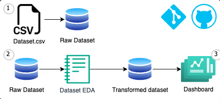

# WorkShop-ETL
First delivery of ETL

---
## Context
This project seeks to provide a solution to the activity called WorkShop, which consists of the cleaning, analysis and visualization of a csv with synthetic candidate data.

This work involved the creation of new columns for the dataframe, graphic visualizations to better understand the data and the use of tools such as Python and jupyter Notebook.

To be considered a hired candidate must have a score equal or higher than 7 in the technical test and technical interview columns.

Here is the dashboard with the main graphs made in Power BI. 

---
## Workflow

